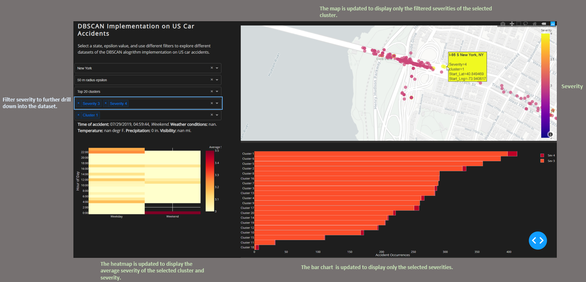

# Team 233 Project: Understanding the Factors for Accident Severity.
This is a demo of our implementation of a density based clustering algorithm to identify hotspots prone to many and severe accidents using Haversine distance metric. We found that our implementation of DBSCAN effectively located accident-prone areas, in terms of both frequency and severity. The demo focuses on interactive visualizing DBSCAN for the top 20 clusters in five different states using 50 and 100 meter radius epsilon overlayed on a map with additional filters to enable drilldowns.

The package contains datasets for five different states used in the dashboard, required python libraries, and python files for running the dashaboard. The dashboard was built using Dash for the main server and interactive components, and Plotly Python to create the interactive plots. 

## Getting Started
#### Running the app locally
Downlaod and unzip the project folder, then install the requirements with pip.

```
pip install -r requirements.txt
```

Run the app.
```
python app.py
```

#### Application Overview
The dashboard consists of inputs to load the dataset, filters for drilldowns, three graphical visualization, and a text output. 

* **Dataset:** there are five different states and two different radius epsilon's to choose from to load the dataset. The visualization will automatically update after selecting your dataset. 
* **Filters:** 
  * The first drop down in filters allow you to choose the top x clusters with the max number of clusters being 20. 
  * The second drop down filters for different accident severities. 
  * The third drop down allows you to select clusters of interest (optional). Selecting clusters will update the cluster map to display accident locations by severity for the selected clusters. Clicking the "x" will revert changes. 
* **Cluster Map** shows the clusters of the accidents.
  * You can zoom in and out using the scroll wheel on the mouse, or pinch-to-zoom on your touch-pad. You can click the home button to reset the zoom. 
  * Hovering over a data point will display the accident location along with the severity and cluster id. This will also output additional information in **Accident Info** section. 
* **Accident Info** is a text output that displays the information of the accident by hovering over a data point on the map.
* **Stacked bar chart** displays the accident occurrences by severity for each cluster. Hovering over each bar displays the number of occurrences of that severity. 
* **Heatmap** displays the average severity of the loaded dataset by hour of the day and weekend/weekday. 

#### Instructions

1. After running the application, select the state and epsilon radius of interest to load the results from the DBSCAN algorithm. 
2. Apply desired filters to update the visualization. 
3. Hover over datapoints in the graphs to display information. 

#### Selecting filters
**Selecting clusters** updates the cluster map to display the accident severities within the clusters as well as the heatmap to gain a deeper insight into the selected cluster. 



