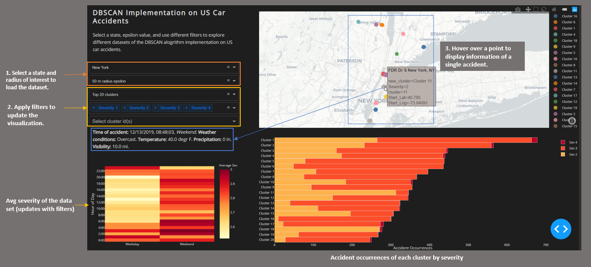
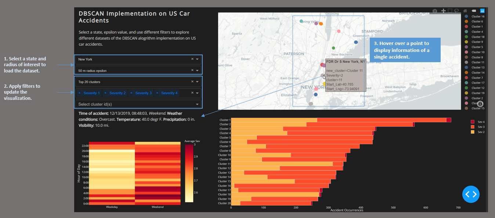

# Team 233 Project: Understanding the Factors for Accident Severity.
This is a demo of our implementation of a density based clustering algorithm to identify hotspots prone to many and severe accidents using Hvesine distance metric. We found that our implementation of DBSCAN effectively located accident-proneareas, in terms of both frequency and severity. The demo focuses on interactive visualizing DBSCAN for the top 20 clusters in five different states using 50 and 100 meter radius epsilon overlayed on a map. There are filters on the left side of the app to update the visualizations.

The package contains datastes for five different states used in the dashboard, required python libraries, and python files for running the dashaboard. The dashboard was built using Dash for the main server and interactive components, and Plotly Python to create the interactive plots. 

## Getting Started
#### Running the app locally
Downlaod and unzip the project folder, then install the requirements with pip.

```
pip install -r requirements.txt
```

Run the app.
```
python app.py
```

#### Application Overview





